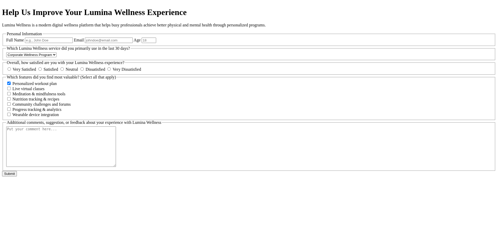
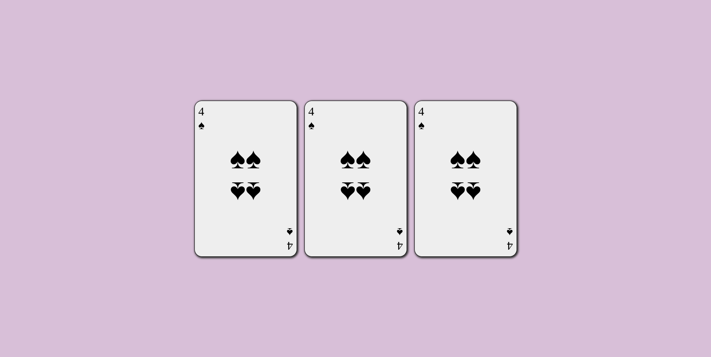
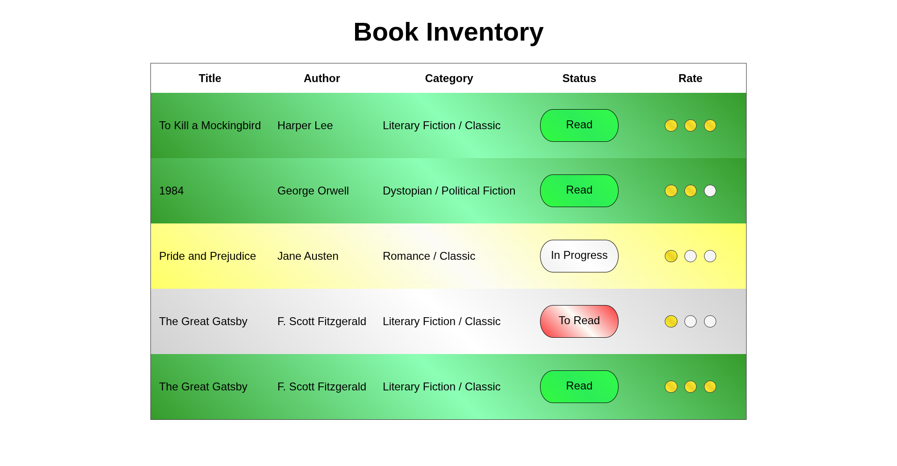
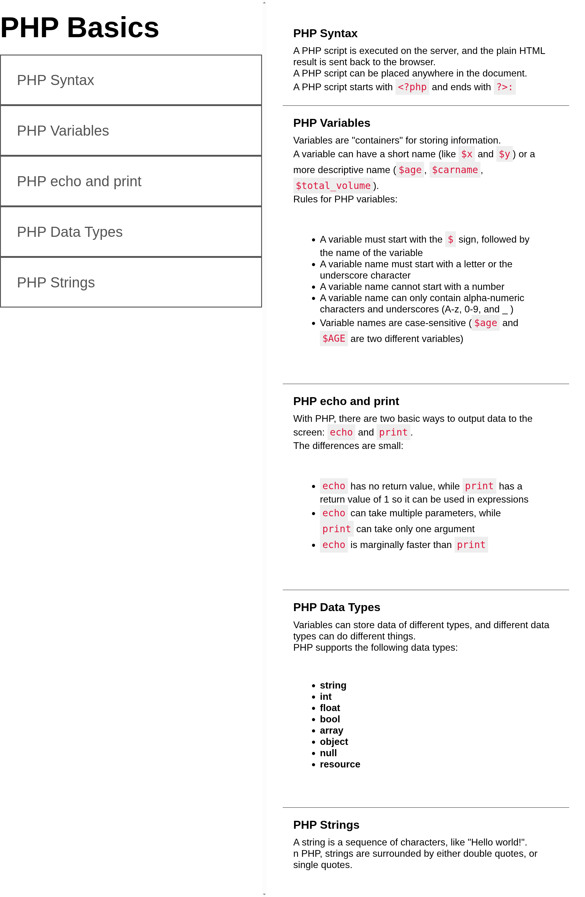
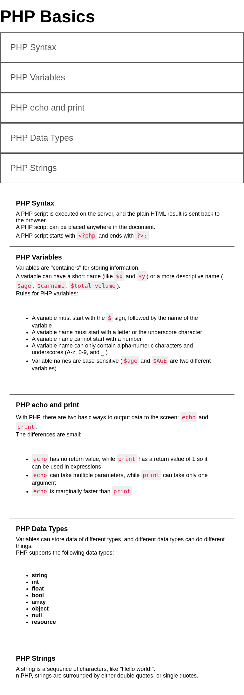
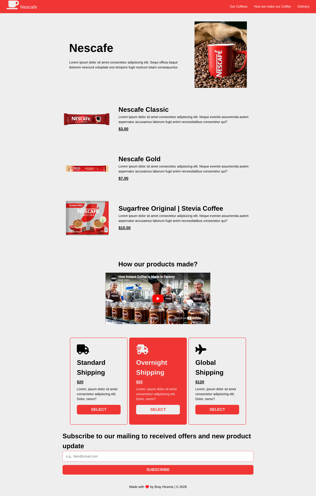
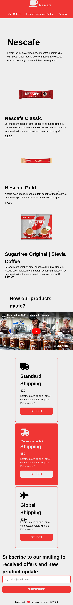
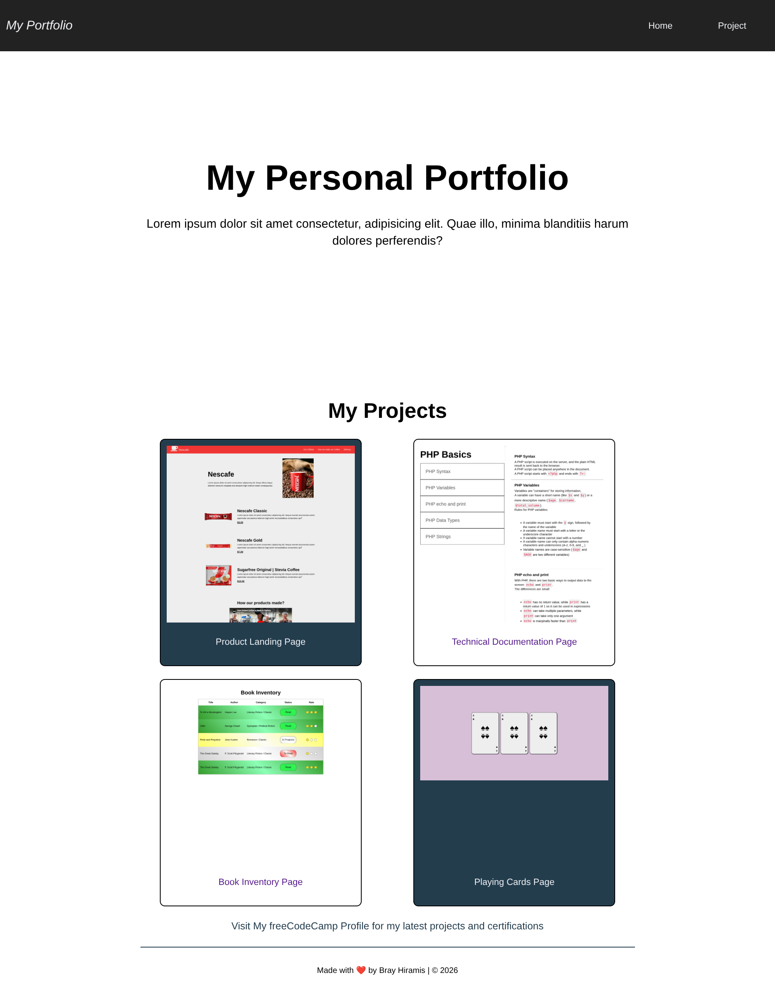
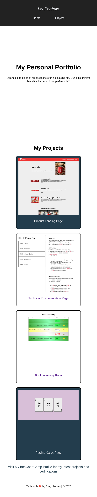

# My freeCodeCamp Responsive Web Design Projects

As part of my journey to become a web developer, I'm taking the freeCodeCamp Responsive Web Design Certification.

## Below are the projects (in order) that I successfully passed:

### 1. Survey Form (HTML module)

### 2. Playing Cards (CSS module)

### 3. Book Inventory App (CSS module)

### 4. Technical Documentation Page (CSS module)
| Desktop View | Mobile View |
| ------------ | ------------ |
|  | 

### 5. Product Landing Page (CSS module)
| Desktop View | Mobile View |
| ------------ | ----------- |
|  | 

## Bonus Project

### fCC Personal Portfolio

| Desktop View | Mobile View |
| ------------ | ----------- |
|  | 

> [!NOTE]
> All projects (excluding Survey Form) uses internal CSS.

Thank you for visiting this repository!

Brian Hiramis - Author